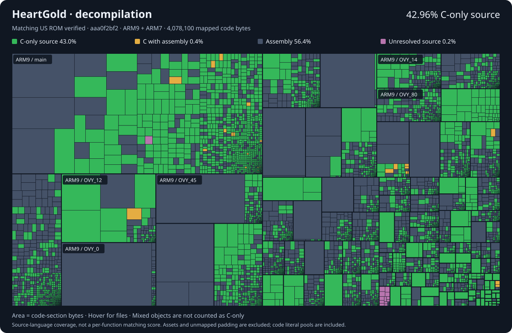

# Pokémon HeartGold and SoulSilver

This is a work-in-progress disassembly of Pokémon HeartGold and SoulSilver, based on the initial work by [pret/pokeheartgold](https://github.com/pret/pokeheartgold). For instructions on how to set up the repository, please read [INSTALL.md](INSTALL.md).

This repository builds the following ROMs:

* **pokeheartgold.us.nds** `sha1: 4fcded0e2713dc03929845de631d0932ea2b5a37`
* **pokesoulsilver.us.nds** `sha1: f8dc38ea20c17541a43b58c5e6d18c1732c7e582`
